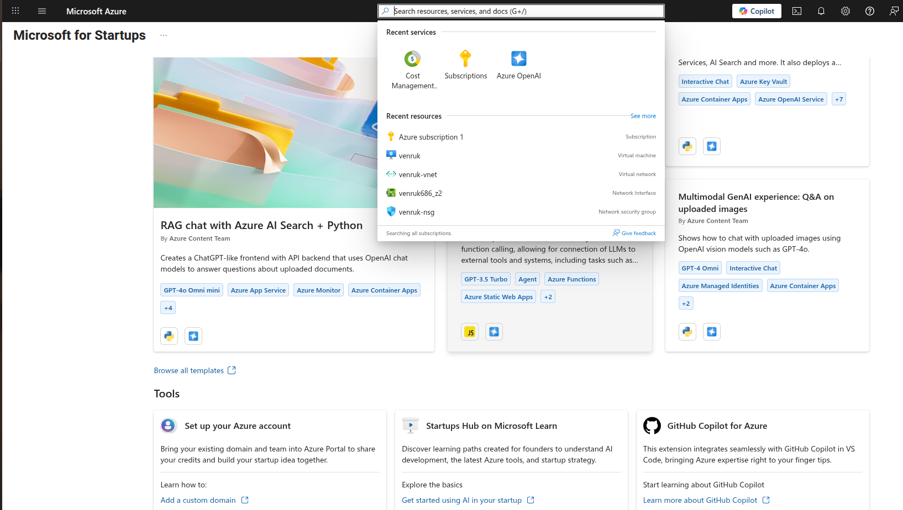
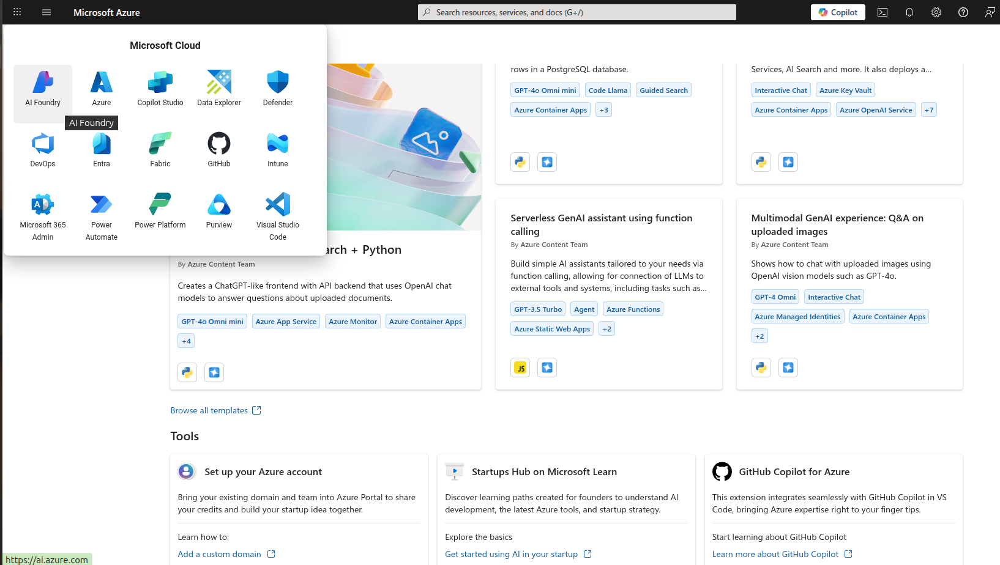
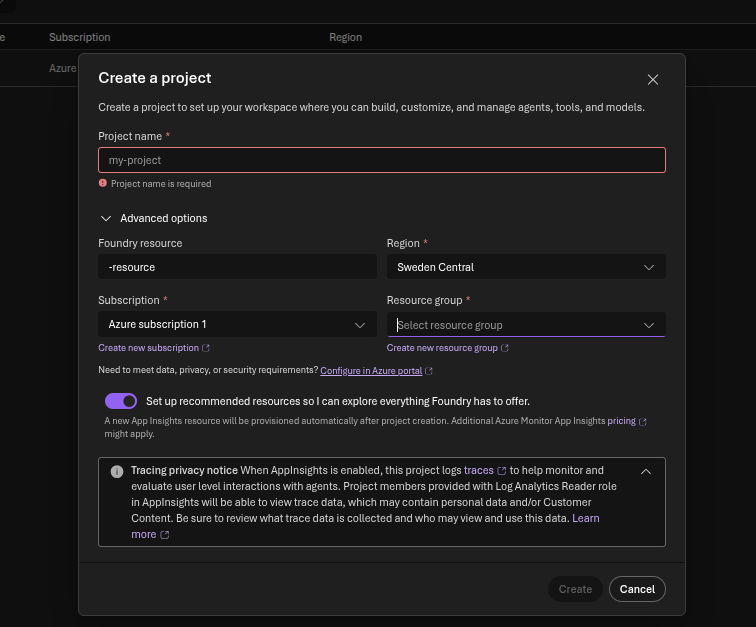
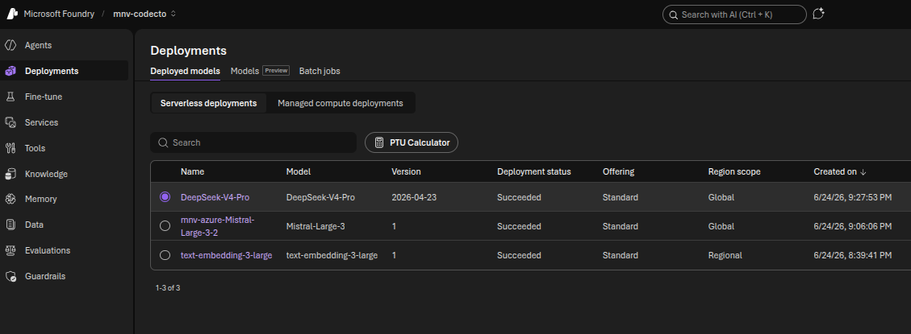
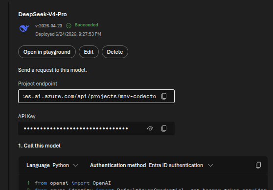
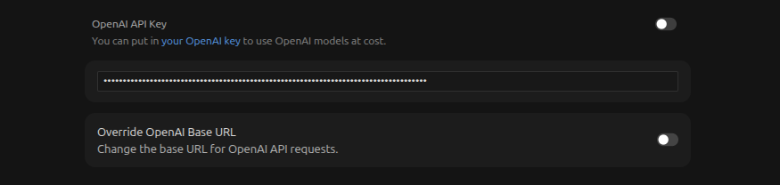

# 🚀 Free AI Models in Your IDE — Powered by Azure AI Foundry

← [Back to Hub](../README.md)

> **Use DeepSeek, Mistral, Meta Llama, Azure OpenAI (GPT) and more — directly in VS Code and Cursor — with $200–$1,000 in free Azure credits. No hidden charges — the card is only for identity verification.**

This guide walks you through the **complete end-to-end process**: from creating a free Azure account, to using powerful AI models like **DeepSeek-V4-Pro**, **Mistral Large**, **Meta Llama**, and **Azure OpenAI GPT** inside your favorite IDE.

---

## 📖 Table of Contents

- [What You Get](#-what-you-get)
- [Step 1: Get Free Azure Credits](#step-1-get-free-azure-credits)
- [Step 2: Set Up Azure AI Foundry](#step-2-set-up-azure-ai-foundry)
- [Step 3: Deploy Models](#step-3-deploy-models)
- [Step 4: Connect to Your IDE](#step-4-connect-to-your-ide)
  - [Method A: Python Script (VS Code / Terminal)](#method-a-python-script-vs-code--terminal)
  - [Method B: API Key (Cursor, Cline, Any Client)](#method-b-api-key-cursor-cline-any-client)
  - [Method C: CLI Token (Quick Testing)](#method-c-cli-token-quick-testing)
  - [Method D: Local Proxy (Any Client)](#method-d-local-proxy-any-client)
- [IDE-Specific Guides](#-ide-specific-guides)
  - [VS Code](#vs-code)
  - [Cursor IDE](#cursor-ide)
  - [Cline (AI Coding Agent)](#cline-ai-coding-agent)
  - [Continue.dev](#continuedev)
- [Available Models](#-available-models)
- [Billing & Credits](#-billing--credits)
- [Project Files Explained](#-project-files-explained)
- [Troubleshooting](#-troubleshooting)
- [FAQ](#-faq)

---

## 🎁 What You Get

| Benefit | Details |
|---------|---------|
| **$200–$1,000 free Azure credits** | $200 via standard sign-up · up to $1,000 via special promotional links (e.g. LinkedIn) · valid for 30 days |
| **Free AI models** | DeepSeek-V4-Pro, Mistral Large, Meta Llama, Azure OpenAI GPT, and more |
| **OpenAI-compatible API** | Works with any tool that supports OpenAI's API format |
| **No subscription needed** | Credits are free, no auto-charge after expiration |
| **Use in VS Code, Cursor, Cline** | Full IDE integration for AI-assisted coding |

> ⚠️ **Available model families on Azure AI Foundry:** Azure OpenAI (GPT-4o, GPT-4 Turbo), Meta (Llama 3), Mistral (Mistral Large), and DeepSeek (DeepSeek-V4-Pro). Other providers may not be available.

---

## Step 1: Get Free Azure Credits

### 1.1 How Much Do You Get?

| Sign-up Method | Credits | Valid For |
|---|---|---|
| **Standard sign-up** at [azure.microsoft.com/free](https://azure.microsoft.com/free) | **$200** | 30 days |
| **Promotional link** (e.g. via LinkedIn campaigns) | **$1,000** | 30 days |
| **Microsoft for Startups** | Up to $150,000 | 12 months |

> 💡 **Pro tip:** Microsoft periodically runs promotional campaigns via LinkedIn and other platforms that give **$1,000** in credits instead of the standard $200. Check LinkedIn posts, Microsoft Azure newsletters, and tech communities for active promo links before signing up.

### 1.2 Create Your Azure Account

1. Go to **[azure.microsoft.com/free](https://azure.microsoft.com/free)** — or use a promotional link if you have one
2. Click **"Start free"**
3. Sign in with your Microsoft account (or create one)
4. Verify your identity with a phone number (no charge)
5. **Add your credit/debit card details** — this is required for identity verification only. You will **NOT be charged**. Azure uses this solely to confirm you are a real person.

> 💳 **Card details step:** Enter your card number, expiry, and CVV when prompted. Microsoft places a small temporary authorization hold (usually $1) that is immediately released. No charges occur as long as you stay within the free tier.

### 1.3 Activate Your Credits & Check Subscription

After signup, verify your credits are active:

1. Go to **[portal.azure.com](https://portal.azure.com)**
2. In the top search bar, type **"Subscriptions"** and click it
3. Click on **"Azure subscription 1"** (or your subscription name)
4. Under **Overview**, check your **Credits** — you should see your balance (e.g. **$200.00** or **$1,000.00** for promo)
5. You can also navigate to **Cost Management** → **Credits** to see the full balance and expiry date

> ✅ If credits show as active, you're ready to proceed. Credits are valid for **30 days** from account creation.

---

## Step 2: Set Up Azure AI Foundry

### 2.1 What is Azure AI Foundry?

Azure AI Foundry (formerly Azure AI Studio) is Microsoft's platform for deploying and managing AI models. Think of it as "your own private OpenAI" — you get access to models from OpenAI, DeepSeek, Mistral, Meta, and more, all billed to your Azure credits.

### 2.2 Create an AI Foundry Project



1. Go to **[ai.azure.com](https://ai.azure.com)**
2. In the top-left, click the **waffle/grid menu** and select **AI Foundry**

   
3. Click **"Create project"** — fill in the form as shown below:

   

4. Fill in the form:
   - **Project name**: anything you like (e.g., `my-project`)
   - **Foundry resource**: create new or use an existing one
   - **Subscription**: select `Azure subscription 1`
   - **Resource group**: create new resource group
   - **Region**: pick one close to you (e.g., `Sweden Central`, `East US`, `West Europe`)

5. Leave **"Set up recommended resources"** toggled **on** — this provisions App Insights automatically
6. Click **Create** and wait ~2 minutes for provisioning

### 2.3 Find Your Project Endpoint

Once provisioned, click on a deployed model and note your **Project endpoint**. It looks like:

```
https://YOUR-RESOURCE.services.ai.azure.com/api/projects/YOUR-PROJECT-NAME
```

Keep this URL — you'll need it for all IDE connections.

---

## Step 3: Deploy Models

### 3.1 Deploy from Model Catalog

1. In AI Foundry, go to **Deployments** (left sidebar)
2. Click the **Models** tab → then click **Deploy model**
3. Browse or search for models (only these families are available on Azure AI Foundry):
   - **Azure OpenAI**: `GPT-4o`, `GPT-4 Turbo`, `GPT-3.5 Turbo`
   - **Meta**: `Llama-3.1-8B-Instruct`, `Llama-3.3-70B-Instruct`
   - **Mistral**: `Mistral-Large-3` *(recommended for reasoning)*
   - **DeepSeek**: `DeepSeek-V4-Pro` *(recommended for coding)*
4. Click **Deploy** → choose **Serverless deployment** (uses credits, no GPU provisioning needed)
5. Note the **deployment name** — this is what you'll use as the `model` parameter



### 3.2 Recommended Deployments

| Model | Deployment Name | Use Case | ~Cost |
|-------|----------------|----------|-------|
| `DeepSeek-V4-Pro` | `DeepSeek-V4-Pro` | Coding, agents | ~$0.55/$2.19 per 1M tokens |
| `Mistral-Large-3` | `Mistral-Large-3` *(your chosen name)* | Reasoning, writing | ~$2.00/$6.00 per 1M tokens |
| `text-embedding-3-large` | `text-embedding-3-large` | Embeddings, RAG | ~$0.13/M tokens |

### 3.3 Copy Your API Key

After deploying, click on the model name in the Deployments list. A detail panel opens showing:
- **Project endpoint** — copy this (format: `https://....services.ai.azure.com/api/projects/YOUR-PROJECT`)
- **API Key** — click the **copy icon** next to the masked key



> 🔑 Keep these two values safe — you'll paste them into your IDE next.

---

## Step 4: Connect to Your IDE

### Prerequisites (All Methods)

```bash
# 1. Install Azure CLI
curl -sL https://aka.ms/InstallAzureCLIDeb | sudo bash    # Linux
# or: brew install azure-cli                                # macOS
# or: winget install Microsoft.AzureCLI                     # Windows

# 2. Login
az login

# 3. Install Python dependencies
pip install openai azure-identity
```

---

### Method A: Python Script (VS Code / Terminal)

**Best for:** Local scripts, Jupyter notebooks, automated workflows.  
**Auth type:** Bearer token (auto-refreshes, no key to manage).

1. Create a file named `run_model.py`:

```python
from openai import OpenAI
from azure.identity import DefaultAzureCredential, get_bearer_token_provider

# 🔧 Replace with YOUR endpoint and deployment name
ENDPOINT = "https://YOUR-RESOURCE.services.ai.azure.com/openai/v1"
DEPLOYMENT = "DeepSeek-V4-Pro"

token_provider = get_bearer_token_provider(
    DefaultAzureCredential(),
    "https://ai.azure.com/.default"
)

client = OpenAI(base_url=ENDPOINT, api_key=token_provider)

response = client.chat.completions.create(
    model=DEPLOYMENT,
    messages=[{"role": "user", "content": "Explain quantum computing in one sentence."}]
)

print(response.choices[0].message.content)
```

> 📁 **Template file:** [`run_model.py`](./run_model.py)

2. Run it:

```bash
python run_model.py
```

✅ No API keys to manage. Tokens auto-refresh. Perfect for development.

---

### Method B: API Key (Cursor, Cline, Any Client)

**Best for:** Cursor IDE, Cline, Continue.dev, any tool that expects an API key.  
**Auth type:** Static key (never expires, generated once).

#### Step B1: Get Your API Key

**Option 1 — From Azure AI Foundry UI (recommended):**
1. Go to **[ai.azure.com](https://ai.azure.com)** → open your project
2. Click **Deployments** in the left sidebar
3. Click on any deployed model (e.g., `DeepSeek-V4-Pro`)
4. In the detail panel, find the **API Key** field — click the **copy icon** (📋) next to the masked key
5. Also copy the **Project endpoint** URL shown above it

**Option 2 — Using Azure CLI:**
```bash
az cognitiveservices account keys list \
  --resource-group YOUR-RESOURCE-GROUP \
  --name YOUR-RESOURCE-NAME \
  --query key1 -o tsv
```

Or use the helper script:

```bash
python get_api_key.py
```

> 📁 **Helper script:** [`get_api_key.py`](./get_api_key.py) — edit the `RESOURCE_GROUP` and `RESOURCE_NAME` at the top to match yours.

#### Step B2: Configure Your Client

| Setting | Value |
|---------|-------|
| **Base URL** | `https://YOUR-RESOURCE.services.ai.azure.com/api/projects/YOUR-PROJECT-NAME` |
| **API Key** | *(paste the key from Step B1)* |
| **Model** | `DeepSeek-V4-Pro` |

✅ The API key **never expires**. Set once, use forever.

---

### Method C: CLI Token (Quick Testing)

**Best for:** One-off testing, curl commands, shell scripts.  
**Auth type:** Bearer token (expires in ~1 hour).

```bash
# Get a token (valid ~1 hour)
TOKEN=$(az account get-access-token \
  --resource https://ai.azure.com/.default \
  --query accessToken -o tsv)

# Test with curl
curl -s "https://YOUR-RESOURCE.services.ai.azure.com/openai/v1/chat/completions" \
  -H "Authorization: Bearer $TOKEN" \
  -H "Content-Type: application/json" \
  -d '{
    "model": "DeepSeek-V4-Pro",
    "messages": [{"role": "user", "content": "Hello, Azure AI!"}]
  }' | python -m json.tool
```

> 📁 **Helper script:** [`get_token.py`](./get_token.py) — generates a fresh token.

---

### Method D: Local Proxy (Any Client)

**Best for:** Clients that don't support Azure Entra ID auth directly.  
**Auth type:** Proxied bearer token (local server handles auth).

Start the proxy:

```bash
python proxy_server.py
```

Then configure any client:

| Setting | Value |
|---------|-------|
| **Base URL** | `http://127.0.0.1:8080/v1` |
| **API Key** | `dummy` (any value — proxy ignores it) |
| **Model** | `DeepSeek-V4-Pro` |

> 📁 **Proxy script:** [`proxy_server.py`](./proxy_server.py) — edit `ENDPOINT` and `DEPLOYMENT_NAME` at the top.

Keep the proxy terminal running while using the client.

---

## 💻 IDE-Specific Guides

### VS Code

VS Code has **two** ways to use AI models:

| Option | Uses | How |
|--------|------|-----|
| **GitHub Copilot** (built-in) | GitHub's own models | Already works — no setup needed |
| **Your Azure models** | DeepSeek, Mistral, etc. | Use Method A (Python) or install **Cline** / **Continue.dev** |

#### Using Method A in VS Code:

1. Open the integrated terminal (`` Ctrl+` ``)
2. Run `python run_model.py` (or your own script)
3. Alternative: Use **Method B (API key)** with the Cline extension (see below)

#### Using the Azure AI Foundry Extension:

1. Install the **"Azure AI Foundry"** extension from the VS Code marketplace
2. Click the Azure icon in the sidebar
3. Sign in and browse your models directly

---

### Cursor IDE

Cursor supports custom OpenAI-compatible providers via its **Override OpenAI Base URL** setting — perfect for your Azure models.

#### Setup (Method B — API Key):

1. Open Cursor → **Settings** (gear icon or `Ctrl+Shift+J`) → **Models** tab
2. Scroll down to **"OpenAI API Key"** — toggle it **on** and paste your API key from Step 3.3
3. Scroll further to **"Override OpenAI Base URL"** — toggle it **on** and paste your project endpoint:

   
   ```
   https://YOUR-RESOURCE.services.ai.azure.com/api/projects/YOUR-PROJECT-NAME
   ```
4. Scroll back up and under **"Model Names"**, add your deployment names:
   - `DeepSeek-V4-Pro`
   - `Mistral-Large-3` *(use whatever deployment name you chose)*
5. Select your model from the model dropdown at the top of the chat panel and start coding!

> 💡 Both **OpenAI API Key** and **Override OpenAI Base URL** must be toggled **on** for Cursor to route requests to Azure instead of OpenAI.

---

### Cline (AI Coding Agent)

[Cline](https://marketplace.visualstudio.com/items?itemName=saoudrizwan.claude-dev) is a powerful AI coding agent extension for VS Code. It can use your Azure models.

#### Setup:

1. Install Cline from the VS Code marketplace
2. Open Cline → **Settings** (gear icon)
3. Set **API Provider** → `OpenAI Compatible`

| Setting | Value |
|---------|-------|
| **Base URL** | `https://YOUR-RESOURCE.services.ai.azure.com/openai/v1` |
| **API Key** | *(your API key from Method B)* |
| **Model ID** | `DeepSeek-V4-Pro` |

> 💡 Cline needs models with **tool calling** support. DeepSeek-V4-Pro handles this well. If you encounter issues, try Mistral Large.

---

### Continue.dev

[Continue](https://marketplace.visualstudio.com/items?itemName=Continue.continue) is an open-source AI code assistant.

#### Setup:

In your `~/.continue/config.json`:

```json
{
  "models": [
    {
      "title": "DeepSeek (Azure)",
      "provider": "openai",
      "apiBase": "https://YOUR-RESOURCE.services.ai.azure.com/openai/v1",
      "apiKey": "YOUR-API-KEY",
      "model": "DeepSeek-V4-Pro"
    }
  ]
}
```

---

## 🧠 Available Models

Azure AI Foundry supports models from **four** providers only. Check the **Model Catalog** in [ai.azure.com](https://ai.azure.com) for the current list, as availability varies by region.

| Provider | Models | Best For |
|----------|--------|----------|
| **Azure OpenAI** | GPT-4o, GPT-4 Turbo, GPT-3.5 Turbo | General purpose, vision, reasoning |
| **Meta** | Llama-3.1-8B, Llama-3.3-70B, Llama-3.2-Vision | Coding, open-source alternative |
| **Mistral** | Mistral-Large-3, Mistral-Small | Reasoning, writing, multilingual |
| **DeepSeek** | DeepSeek-V4-Pro, DeepSeek-Coder | Code generation, debugging, agents |

> ⚠️ **Note:** Models from Anthropic (Claude), Google (Gemini), Cohere, or other providers are **not available** on Azure AI Foundry. Only the four families above are supported.

---

## 💰 Billing & Credits

### How Billing Works

- You pay per **token** (input + output)
- Costs are deducted from your Azure credits ($200 standard · $1,000 promotional)
- No charges to your card as long as you have credits
- Credits expire after **30 days** from account creation

### Monitor Your Spending

1. Go to **[portal.azure.com](https://portal.azure.com)** → search **"Subscriptions"**
2. Click **"Azure subscription 1"** → view **Credits** under Overview
3. Set up a **budget alert** in **Cost Management** to notify you when nearing your limit

### Approximate Costs

| Model | Input (per 1M tokens) | Output (per 1M tokens) |
|-------|----------------------|------------------------|
| DeepSeek-V4-Pro | ~$0.55 | ~$2.19 |
| Mistral Large | ~$2.00 | ~$6.00 |
| text-embedding-3-large | ~$0.13 | N/A |

> With $1,000 credits, you can process **hundreds of millions of tokens** — that's months of heavy coding use.

---

## 📂 Project Files Explained

| File | What It Does | When to Use |
|------|-------------|-------------|
| [`run_model.py`](./run_model.py) | Test script using bearer token auth | **Method A** — VS Code, scripts |
| [`get_api_key.py`](./get_api_key.py) | Prints your static API key | **Method B** — Cursor, Cline, any client |
| [`get_token.py`](./get_token.py) | Prints a one-hour bearer token | **Method C** — Quick curl tests |
| [`proxy_server.py`](./proxy_server.py) | Local HTTP proxy (handles auth for you) | **Method D** — Any client |
| [`requirements.txt`](./requirements.txt) | Python package dependencies | `pip install -r requirements.txt` |
| [`SETUP.md`](./SETUP.md) | Detailed technical reference | Deep dive into each method |

---

## 🔧 Troubleshooting

| Problem | Solution |
|---------|----------|
| **"Authentication failed"** | Run `az login` again. Tokens expire after ~1 hour. |
| **"Deployment not found"** | Check your deployment name matches exactly. Case-sensitive! |
| **"Model not available in region"** | Try deploying in a different region (eastus, swedencentral, westeurope). |
| **"Quota exceeded"** | Each model has a token-per-minute limit. Wait and retry. |
| **"Connection refused" (proxy)** | Make sure `python proxy_server.py` is running. |
| **Cline not generating code** | Some models don't support tool calling. Try DeepSeek-V4-Pro or Mistral Large. |
| **Cursor says "invalid API key"** | You may be using a bearer token instead of an API key. Use Method B. |

---

## ❓ FAQ

### Q: Is this really free?
**A:** Yes! Standard sign-up gives $200 free credits. Promotional links (often shared via LinkedIn) can give up to $1,000. You're never auto-charged. When credits expire, your services stop — you manually choose to upgrade to pay-as-you-go.

### Q: What happens after my credits expire?
**A:** Your deployments pause. You can either add funds or wait for the next free credit offer.

### Q: Can I use this for commercial projects?
**A:** Yes! There are no restrictions on how you use the models. The credits work the same as paid Azure.

### Q: Which model is best for coding?
**A:** **DeepSeek-V4-Pro** is our top recommendation. It's fast, affordable, and excellent at code generation. For general reasoning, **Mistral-Large-3** is a great alternative.

### Q: Do I need a GPU or powerful computer?
**A:** No! Everything runs on Azure's cloud. You just need an internet connection and any modern laptop.

### Q: How does this compare to ChatGPT/Copilot subscriptions?
**A:** ChatGPT Pro is $200/month. GitHub Copilot is $10/month. With Azure credits, you pay **per token** instead of a flat fee — which can be much cheaper if you use it moderately. Plus, you get access to models from Azure OpenAI, Meta, Mistral, and DeepSeek — not just one provider.

### Q: Can I share my credits/endpoint with friends?
**A:** Yes, but they'll need either an API key or Azure credentials with access to your resource. For teams, set up proper RBAC (Role-Based Access Control) in the Azure portal.

---

## 🤝 Contributing

Found a better way to set this up? Have a model recommendation? Open an issue or PR!

## 📜 License

This guide is MIT licensed. The models themselves have their own licenses — check Azure AI Foundry for each model's terms.

---

<p align="center">
  <b>Made with ☁️ Azure AI Foundry</b><br>
  <i>Azure OpenAI · Meta · Mistral · DeepSeek — free credits, free knowledge.</i>
</p>